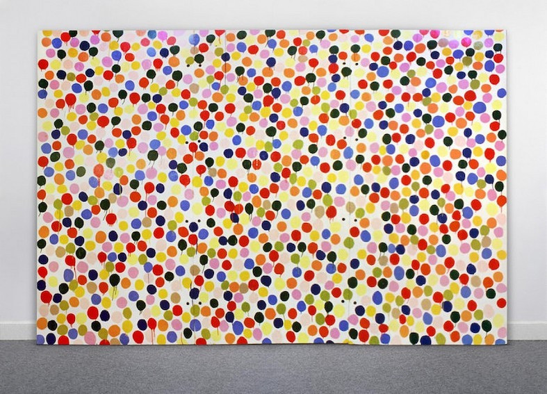

# zyan9696_9103_TUT02_Individual-Work

# zyan9696_9103_TUT02_GroupE

## The Instruction of Individual Work:
In my individual work, pill shapes move randomly in the background. The background color changes automatically over time. Some food icons grow and shrink automatically.

## The Individual Code: 
Perlin Noise

## The Animation Explanation:
I transitions from a static to a dynamic state by removing noLoop(), but initially, this makes the movement of the pill shapes too rapid. To address this and achieve a more natural motion, I use Perlin noise. Perlin noise provides smooth random variations, allowing the movement speed of the pills to be more controlled and organic. It creates the random movement of pill shapes in the background, giving them a fluid and natural dynamic effect. Meanwhile, the background color changes automatically over time, allowing viewers to feel the continuous evolution of the scene. Moveover, some food icons in the composition periodically grow and shrink, with a rhythmic frequency that enhances the visual interest and brings a sense of visual rhythm. These combined dynamic effects infuse the entire piece with energy and vitality.

## The Inspiration:
The inspiration I gained from Damien Hirst's Spot Painting made me reflect on the infinite possibilities of simple shapes. This piece uses densely packed colored dots as its main element, creating an abstract yet harmonious visual effect through repeated dot patterns. The different-colored dots are randomly distributed across the canvas, each appearing independent yet interconnected, evoking a sense of intricate complexity and unified balance. This style inspired me to incorporate randomly distributed pill-like shapes into my work, allowing them to freely populate the background, creating an effect that is both vibrant and orderly.


## The Technical Explanation:
I define a randomPillShape class to create different types of pill shapes and use Perlin noise to achieve smooth, random motion. The size and movement range of each pill are generated randomly, ensuring that each pill has a unique appearance within the composition.
```javascript
//This class creates and manages random shapes with randomPillShape
class randomPillShape {
  constructor(type) {
    this.type = type;
    // Initial random position on x-axis
    this.x = random(0.8);
    // Initial random position on y-axis
    this.y = random(0.8); 
    // Relative size of the pill
    this.size = random(0.005, 0.015);
    // Scale factor for noise movement
    this.PillScale = random(0.1, 0.3);
    // Starting point for Perlin noise
    this.PillLocation = random(10);
  }
  display() {
    noStroke();
    // Calculate the actual size based on the canvas dimensions
    let minDimension = min(width, height);
    let size = this.size * minDimension;
    //Samples the Perlin Noise for x and y,
    //x generates natural movement,
    //y generates a more varied movement pattern by adding 10
    let xNoise = noise(this.PillLocation);
    let yNoise = noise(this.PillLocation + 10);
    //The position of the shape is calculated by adding the noise values to its initial position
    let x = (this.x + xNoise * this.PillScale) * width;
    let y = (this.y + yNoise * this.PillScale) * height;
    // Draw the shape based on the type
    switch (this.type) {
      case 'Pill1':
        this.drawPill1(x, y, size);
        break;
      case 'Pill2':
        this.drawPill2(x, y, size);
        break;
      case 'Pill3':
        this.drawPill3(x, y, size);
        break;
      case 'Pill4':
        this.drawPill4(x, y, size);
        break;
    }
    // Increment noise location to create smooth movement
    this.PillLocation += 0.01;
  }
  //Draw white pills
  drawPill1(x, y, size) {
    fill(255, 255, 255);
    circle(x, y, size);
  } 
}
```
I used Perlin noise to generate smoothly changing color values, creating an automatically shifting background color effect. Using the Perlin noise, noise() generates a smooth random value based on noiseOffset. Since Perlin noise has continuity, it produces gradual and natural changes. The map() function maps noiseValue (output range 0 to 1) to specified ranges for the red, green, and blue channels to create a gradient background color. The increment of noiseOffset += controls the speed of the color change. I have learnd from https://editor.p5js.org/jarivkin/sketches/KkuvWGhDv.
```javascript
let noiseOffset = 0;
function draw(){
  //Generate a color value
  let noiseValue = noise(noiseOffset);
  //Map the output of Perlin noise to the color range from 0 to 255
  let r = map(noiseValue, 0, 1, 235, 255);
  let g = map(noiseValue, 0, 1, 140, 240);
  let b = map(noiseValue, 0, 1, 150, 230);
  //Set the background color that can automatically changes
  background(r, g, b);
  //Increment the offset value slightly each frame
  noiseOffset += 0.015;
}
```
ScaleFactor controls the dynamic scaling effect of the food icons, making them periodically grow and shrink on the canvas. The value of scaleFactor is controlled by a sine wave generated by sin(frameCount * scaleSpeed). This sine wave creates smooth, cyclical changes between minimum and maximum values.
```javascript
let scaleFactor = 1;
//the speed of scaling;
let scaleSpeed = 0.03;
function draw(){
    //Use sin() to create a smooth oscillation for scaleFactor
    scaleFactor = map(sin(frameCount * scaleSpeed), -1, 1, 0, 1.4);
    // Draw the food with scaling effect
    // Relative position (50% x)
    let x1 = 0.5; 
    // Relative position (50% y)
    let y1 = 0.5; 
    // Radius dynamically adjusted
    let r1 = 0.2*side; 
    // Draw the food with the position
    drawLimeCake(0.56, 0.55, r1 * scaleFactor, min(side, side));
    drawPizza(0.46, 0.85, r1 * scaleFactor, min(side, side));
    drawLightDonut(0.07, 0.4 , r1 * scaleFactor, min(side, side));
    drawBurger( 0.63, 0.27 , r1 * scaleFactor, min(side, side));
    drawSushi( 0.135, 0.13 , r1 * scaleFactor, min(side, side));
}
```